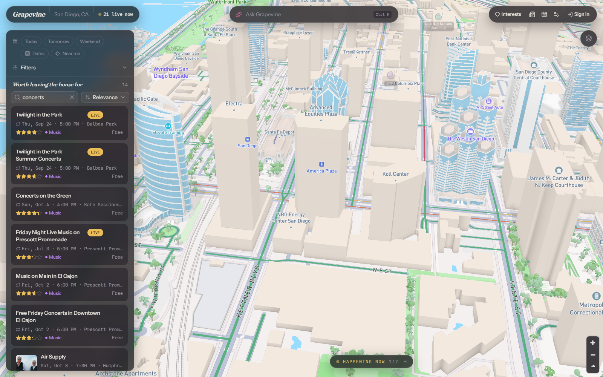
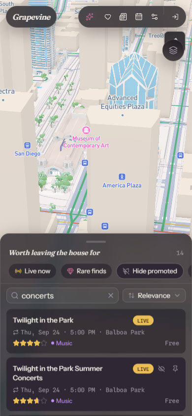
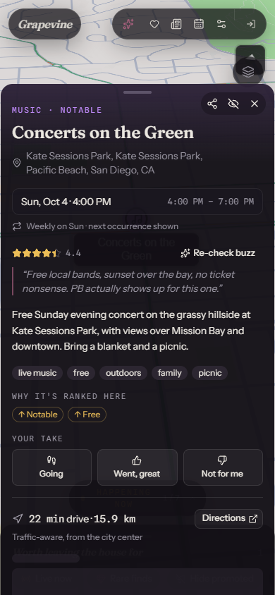
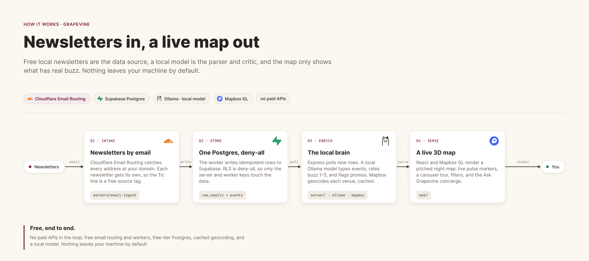
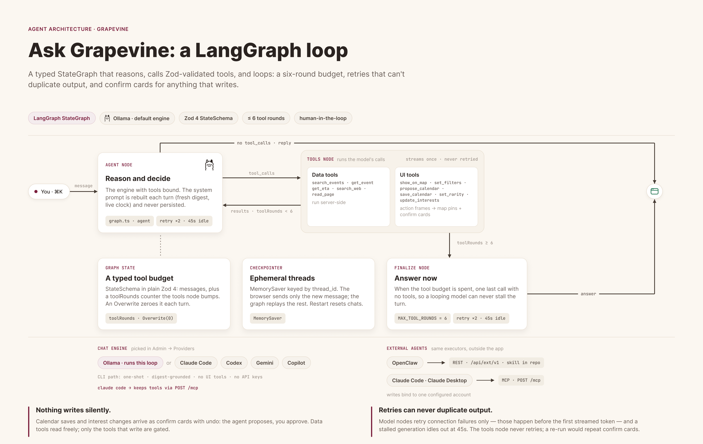

# Grapevine

**Local events worth going to, on a 3D map.**

[](https://github.com/21sean/GrapevineOS/actions/workflows/ci.yml)
[](https://github.com/21sean/GrapevineOS/releases/latest)
[](LICENSE)

[Screenshots](#screenshots) · [Quick start](#quick-start) · [Diagrams](#how-it-works) · [Documentation](#documentation) · [Releases](https://github.com/21sean/GrapevineOS/releases)

Grapevine turns local newsletters and verified web discoveries into a map of
San Diego events. Browse by date, category, and drive time, learn what is on
nearby, or ask the concierge to help plan your day.



_Downtown San Diego, zoomed in to show the high rises. Captured from the running app with 3D buildings enabled._

## Explore the city

- **See events in context.** A pitched Mapbox map, category icons, live event
  markers, and a tour that moves between current events.
- **Find your kind of plans.** Search, dates, rare finds, category filters,
  drive-time areas, and rankings that respond to your interests and reactions.
- **Keep the details close.** Venue information, directions, calendar conflicts,
  event sharing, and calendar export sit alongside the map.
- **Ask for help.** The concierge searches the event catalog, suggests day plans,
  and proposes calendar saves, watches, and interest changes for you to confirm.

Run the agent with local Ollama models or a supported subscription CLI.
Supabase stores events and account data, and Mapbox supplies the map and location
services. Optional integrations add newsletter delivery, Google Calendar sync,
push reminders, and tracing.

## Screenshots

Real UI captures featuring community concerts. The phone layout keeps the map
visible while you browse, then opens a scrollable sheet for an event's details.

<p align="center">
  
  
</p>

_Browse community concerts, then open an event for ratings, reactions, and directions._

## Quick start

You need **Node 22.23.3** (pinned in [.nvmrc](.nvmrc)), a **Supabase project**,
a **Mapbox account**, and an **Ollama model or supported subscription CLI**.
See [setup and operations](docs/setup.md) for supported Node versions and the
full configuration walkthrough.

### 1. Install

```bash
git clone https://github.com/21sean/GrapevineOS.git
cd GrapevineOS
npm install --workspaces --include-workspace-root
```

### 2. Configure

Copy the templates and fill in your credentials:

```bash
cp server/.env.example server/.env
cp web/.env.example web/.env.local
```

| File             | Required configuration                                                    |
| ---------------- | ------------------------------------------------------------------------- |
| `server/.env`    | `SUPABASE_URL`, `SUPABASE_SECRET_KEY`, `MAPBOX_SECRET_TOKEN`              |
| `web/.env.local` | `VITE_SUPABASE_URL`, `VITE_SUPABASE_PUBLISHABLE_KEY`, `VITE_MAPBOX_TOKEN` |

On Windows, use `Copy-Item` in place of `cp` if needed. Keep secret keys in the
server environment. The browser uses publishable and public tokens.

Link your Supabase project and apply the migrations with its CLI:

```bash
supabase link --project-ref <your-project-ref>
supabase db push
```

For a local model, install Ollama and run `ollama pull qwen3:8b`.
Alternatively, choose Claude Code, Codex, Gemini, or Copilot in
**Admin → Providers** after startup. Each CLI uses its existing sign-in.

### 3. Run and add events

```bash
npm run doctor
npm run dev
```

Open **http://localhost:5174**. The API listens on **http://localhost:8787**.
A fresh database starts empty. Paste a newsletter into **Admin → Ingest**, or
use **Admin → Discover** to review and add verified events.

Press **Ctrl K** on Windows and Linux, or **⌘K** on macOS, to open Ask Grapevine.

## How it works

### From newsletters to the map

Newsletters become structured events, enriched with local buzz ratings and
venue coordinates, then appear on the 3D map. Local models handle extraction;
Supabase and Mapbox provide hosted storage and location services.

<p align="center">
  
</p>

### Newsletter delivery

The email worker parses incoming newsletters and stores them once. Delivery
recovery keeps failed inserts available for retry.

<p align="center">
  
</p>

### Ask Grapevine

The agent screens messages, recalls conversation context, calls validated
tools, and keeps durable thread memory. Actions that write arrive as proposals
for you to confirm.

<p align="center">
  
</p>

### Guardrails

Input and fetched content pass through classifier checks. A separate output
filter runs on the streamed response. The
[technical guide](docs/product-guide.md#guardrails) explains the checks and
their failure behavior.

<p align="center">
  
</p>

### Interest learning

Interests and event reactions adjust tag affinities and personal scores. The
same ranking signals feed the map, event list, weekly view, and notifications.

<p align="center">
  
</p>

See the [product guide](docs/product-guide.md) and
[agent architecture](docs/agent-architecture.md) for the complete walkthrough.

## Documentation

| Guide                                                | Covers                                                                           |
| ---------------------------------------------------- | -------------------------------------------------------------------------------- |
| [Setup and operations](docs/setup.md)                | Accounts, configuration, deployment, auth, email delivery, and optional services |
| [Product and technical guide](docs/product-guide.md) | App tour, event ingestion, discovery, ranking, guardrails, MCP, and REST         |
| [Agent architecture](docs/agent-architecture.md)     | LangGraph state, tool contracts, streaming, and durable memory                   |
| [Mapbox Places](docs/mapbox-places.md)               | Venue lookups, scope requirements, caching, and quotas                           |
| [Changelog](docs/CHANGELOG.md)                       | Release notes and project history                                                |
| [Contributing](.github/CONTRIBUTING.md)              | Development workflow, tests, evals, and migrations                               |
| [Security](.github/SECURITY.md)                      | Trust boundaries and reporting a vulnerability                                   |

## Development

One workspace install covers the API, web app, and email worker.

```bash
npm run typecheck
npm test
npm run build
npm run lint
npm run format:check
npm run contracts:check
```

CI also runs five offline evaluation suites. Model evaluations and the red team
run on the optional GPU workflow. See [contributing](.github/CONTRIBUTING.md)
for the full validation commands.

| Directory               | Purpose                                                          |
| ----------------------- | ---------------------------------------------------------------- |
| `web/`                  | React UI, Mapbox rendering, filters, event details, and chat     |
| `server/`               | Express API, LangGraph agent, integrations, MCP, and evaluations |
| `shared/`               | Domain types, recurrence, ranking signals, and time calculations |
| `workers/email-ingest/` | Cloudflare newsletter intake and delivery recovery               |
| `supabase/`             | Database migrations                                              |
| `docs/`                 | Setup, architecture, product guide, and UI screenshots           |

Licensed under [Apache-2.0](LICENSE). See the
[third-party notices](docs/THIRD_PARTY_NOTICES.md) and
[code of conduct](.github/CODE_OF_CONDUCT.md).
