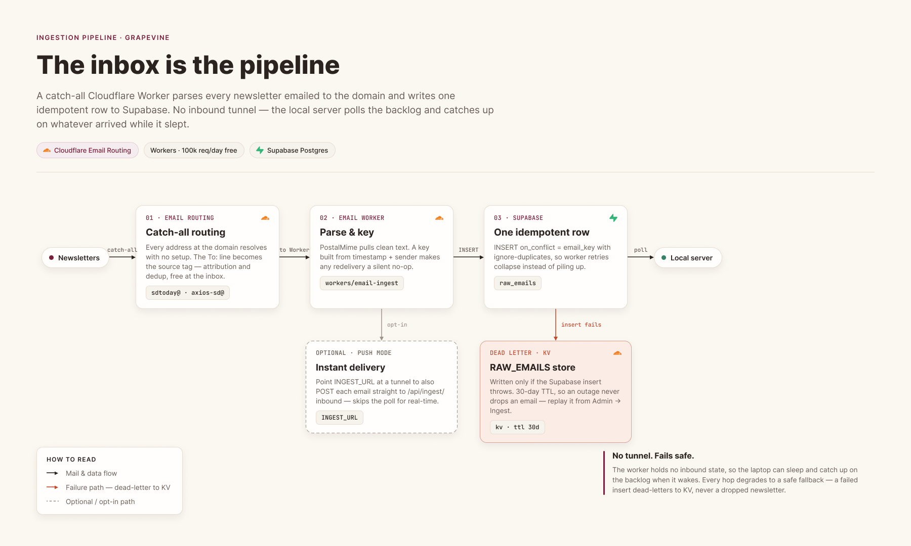

# Grapevine _Agentic Local-Events Platform_

[](https://github.com/21sean/grapevine/actions/workflows/ci.yml)
[](LICENSE)

A live 3D map of the San Diego events locals actually go to, and a reference
for building an agent into an app. Free local newsletters are the data
source, a local LLM is the parser and critic, and the map only surfaces what
has real buzz. The concierge that plans your week is a LangGraph graph with
its guardrails as nodes, durable memory in Postgres, one tool contract shared
by the app, MCP and REST, and a test and eval ladder that runs with no GPU.
Everything runs locally and on free tiers, so nothing leaves your machine by
default.

Setup, deployment, and operations live in [docs/setup.md](docs/setup.md). The
agent's design, and why each part is the shape it is, lives in
[docs/agent-architecture.md](docs/agent-architecture.md).

## Ten minutes to ⌘K

The minimum viable clone is a Supabase project, Ollama with one model, and a
Mapbox account. Everything else is optional and listed below with what it
adds.

1. **Accounts.** Create a free [Supabase](https://supabase.com) project and
   note its project URL, secret key and publishable key (Settings -> API).
   Create a [Mapbox](https://account.mapbox.com) account and make a public
   token (`pk.`) and a secret token (`sk.`).
2. **A model.** Install [Ollama](https://ollama.com) and pull a tools-capable
   model: `ollama pull qwen3:8b`. No GPU? Skip this step and pick a
   subscription CLI (Claude Code, Codex, Gemini or Copilot) under
   Admin -> Providers once the app is up; each signs in with the account you
   already have.
3. **Clone and install.** One install covers the server, the web app and the
   worker.

   ```bash
   git clone https://github.com/21sean/grapevine && cd grapevine
   npm install
   ```

4. **Two env files, three values each.**

   ```bash
   cp server/.env.example server/.env      # SUPABASE_URL, SUPABASE_SECRET_KEY, MAPBOX_SECRET_TOKEN
   cp web/.env.example web/.env.local      # VITE_MAPBOX_TOKEN, VITE_SUPABASE_URL, VITE_SUPABASE_PUBLISHABLE_KEY
   ```

5. **Schema.** With the [Supabase CLI](https://supabase.com/docs/guides/local-development)
   signed in: `supabase link --project-ref <ref>`, then `supabase db push`.
6. **Check and run.**

   ```bash
   npm run doctor     # says exactly what is missing, if anything
   npm run dev        # api -> http://localhost:8787, web -> http://localhost:5174
   ```

7. **Fill the map and ask.** A fresh database has no events. Paste a
   newsletter into Admin -> Ingest, or run a search in Admin -> Discover, then
   hit ⌘K and ask what's good tonight.

Everything else switches on when you want it:

| Adds                                            | Needs                                                                         | Where                                                                               |
| ----------------------------------------------- | ----------------------------------------------------------------------------- | ----------------------------------------------------------------------------------- |
| Newsletters that land by themselves             | a Cloudflare zone with Email Routing and the worker deployed                  | [setup: the email worker](docs/setup.md#the-email-worker)                           |
| Sign-in, per-account history, calendar, watches | Google or GitHub enabled on the Supabase project                              | [setup: auth](docs/setup.md#auth-supabase-auth-google--github)                      |
| Google Calendar sync                            | an OAuth client with the Calendar API enabled                                 | [setup: auth](docs/setup.md#auth-supabase-auth-google--github)                      |
| Traces in Langfuse                              | Docker: `docker compose --profile observability up -d`, keys in `server/.env` | [setup: the optional stack](docs/setup.md#the-optional-stack)                       |
| Sturdier web search                             | Docker: `docker compose --profile search up -d`, `SEARXNG_URL`                | [setup: the optional stack](docs/setup.md#the-optional-stack)                       |
| Claude Desktop or claude.ai as a client         | public HTTPS (a tunnel) and `MCP_PUBLIC_URL`                                  | [setup: MCP](docs/setup.md#mcp-for-claude-desktop--claudeai-custom-connector-oauth) |
| The prompt-injection classifier                 | nothing: about 280 MB downloads on the first chat; `GUARDRAILS=off` skips it  | [Guardrails](#guardrails-prompt-injection-and-persona-defense)                      |
| Venue cards on the event panel                  | the `places:read` scope on the secret token                                   | [docs/mapbox-places.md](docs/mapbox-places.md)                                      |
| Push reminders and the Sunday digest            | nothing: VAPID keys are minted on first use                                   | [App tour](#app-tour)                                                               |

## Highlights

- **Newsletter-to-map pipeline.** Local newsletters arrive by email, a
  Cloudflare Email Worker lands them in Postgres, and a local Ollama model
  extracts typed events, rates their "local buzz" 1 to 5, and flags
  pay-to-play placements before they are geocoded onto the map.
- **Verified web discovery.** The server can also build events from an AI
  web search (keyless search, page reads, LLM extraction), but nothing
  reaches the map without passing a verification gate: deterministic checks
  plus a skeptical second LLM pass that must confirm each candidate against
  its source page (with a supporting quote) or reject it with a reason.
  Searches can run once or on a saved schedule.
- **A guarded concierge agent.** "Ask Grapevine" (hit ⌘K) is a LangGraph
  agent with typed graph state, Zod-validated tools, streaming token output,
  durable per-thread memory, and human-in-the-loop confirmation for anything
  that writes.
- **Guardrails as graph nodes.** Meta's Llama Prompt Guard 2 classifier
  screens user messages and all fetched web content for prompt injection as
  nodes in the graph, so a blocked turn is a routing decision you can see in
  a trace, and a deterministic output rail makes model-identity leaks
  impossible rather than merely improbable.
- **One tool contract.** Every tool is declared once and derived everywhere:
  the graph, the MCP server that Claude Code, Claude Desktop or any MCP
  client can drive, the authenticated external REST API, and the generated
  OpenClaw skill file. CI fails if any copy is stale. Adding a tool is one
  contract entry and one executor.
- **Proof that runs without a GPU.** Unit tests for the graph routing, the
  checkpointer, the streaming bridge, the persona rail and the contracts;
  five offline eval suites in CI on every push; the model suites and a PyRIT
  red team nightly.
- **Venue intelligence on the event panel.** Mapbox Places (public preview)
  fills in what the listing never tells you: whether the place is open right
  now, whether the door is step-free, whether it is known with locals, and
  an hourly busyness chart with the event's own hours lit up, so the answer
  is "what am I walking into at 8pm" rather than a generic POI card. Lookups
  are lazy and cached in Postgres by venue id, so a bar shared by five events
  is fetched once and the preview quota lasts. See
  [docs/mapbox-places.md](docs/mapbox-places.md).
- **Free end to end.** No paid APIs anywhere in the loop: free email
  routing, free workers, free-tier Postgres, cached geocoding, and
  keyless web search.

## How it works

Newsletters come in by email, land in Postgres, get enriched by a local model,
and surface on a 3D map. No paid APIs, no inbound tunnel, nothing leaves your
machine by default.

<p align="center">
  
</p>

### The data-source playbook (no paid APIs)

1. **Cloudflare Email Routing is free and unlimited.** Enable catch-all on
   your domain and every address at it just works, with no per-address setup.
2. **Subscribe to each newsletter with its own address**
   (`sdtoday@yourdomain.com`, `axios-sandiego@yourdomain.com`, and so on).
   The `To:` header becomes the source tag, which gives you attribution and
   dedup for free, at the inbox layer.
3. **The richest sources are pure event digests**: SDtoday (6AM City), Axios
   San Diego, San Diego Reader, Voice of San Diego's Culture Report, PACIFIC,
   Parks & Rec newsletters, and neighborhood association blasts. They are
   written to be skimmed, so they parse cleanly.
4. **A local Ollama model does the rest**: extraction into typed JSON, venue
   geocoding (Mapbox, cached), a jaded-local 1 to 5 buzz rating, and a
   `promoted` flag for pay-to-play placements. Nothing leaves your machine.

The inbox is the pipeline. Each newsletter lands as one idempotent Postgres
row, and the server hears about it over Supabase Realtime and extracts on
arrival. That subscription is an outbound websocket, so it works from a laptop
behind NAT with nothing exposed to the internet. If an insert ever fails, the
worker dead-letters the raw email to KV and retries it on an hourly cron until
it lands, so an outage costs latency rather than the email:

<p align="center">
  
</p>

You can also paste any newsletter into **Admin -> Ingest** at any time, preview
what the model extracted, and approve which events land. Same pipeline,
manual entry, and the clearest human-in-the-loop demo in the app.

### Web discovery (search -> verify -> map)

Newsletters are the spine, but they miss things. **Admin -> Discover** (and the
`discover_events` MCP tool, and `POST /api/ext/v1/discovery/run`) tops the map
up from the open web without trusting the model's first draft:

1. **Search** the query (city appended automatically) via SearXNG or the
   keyless DuckDuckGo fallback, then **read** the top result pages through the
   same Readability + SSRF-guard pipeline the agent uses.
2. **Extract** candidates one page at a time, so every candidate stays
   attributable to exactly one URL.
3. **Verify** before anything is written:
   - deterministic gates: parseable dates, not in the past, not absurdly far
     out, and the title must literally appear in the page text (a cheap
     hallucination check);
   - a second, skeptical LLM pass re-reads the page and must **confirm** the
     event (date, venue, plus a supporting quote), **correct** a detail from
     the page, or call it **unsupported**;
   - candidates corroborated by two or more independent pages clear a lower
     confidence bar; everything else needs `DISCOVERY_MIN_CONFIDENCE`
     (default 0.7).
4. **Commit**: verified events land with `sourceKind: "search"` and the
   `sourceUrl` they were verified against; rejected candidates are reported
   with their reason but never written. Every run is logged in ingest history.

Saved searches re-run on a cadence (1 hour to 2 weeks) via a scheduler in the
server. Set them up in Admin -> Discover, over MCP (`schedule_search`), via the
external REST API, or as a personal **watch** from the chat: ask for "keep an
eye out for jazz nights" and the agent proposes a watch card you confirm, up
to five per account, managed under Account -> Watches.

## Ask Grapevine (the agent)

Hit **⌘K** (or the "Ask Grapevine" pill in the top bar) and talk to the map:
_"what's good tonight?"_, _"plan my Saturday"_, _"can I make it to the farmers
market by 9?"_, _"I hate EDM"_. The concierge runs on the same local Ollama
model as ingestion (pick a tools-capable one like `qwen3` in Admin -> Models):

- **Grounded**: every answer draws on a digest of the live event set, so it
  can't invent events.
- **Drives the map**: recommended events pulse wine-colored and the camera
  fits them, even ones your current filters would hide.
- **Tools**: structured event search, traffic-aware ETAs, day-planning with a
  one-tap save-to-calendar card, watches, and interest tuning. Calendar saves,
  watches and interest changes are always proposed as cards you confirm (with
  Undo); the agent never mutates anything silently.
- **Transparent**: the popover next to the composer says who is answering,
  which tools it has, whether the rails are on, and where an MCP client
  connects to the same toolbox (`GET /api/agent/capabilities` is public and
  says the same).
- **Guarded**: a local classifier screens every message and all web content
  for prompt injection, and a deterministic persona rail stops the model from
  ever breaking character or leaking which LLM powers it (see below).

No GPU, or just prefer a frontier model? **Admin -> Providers** can hand
either job, chat or newsletter extraction or both, to a subscription-authed
CLI instead: Claude Code (`claude -p`), OpenAI Codex, Gemini CLI, or GitHub
Copilot CLI. Each signs in with the account you already have (Claude.ai,
ChatGPT, Google, GitHub), so no API keys ever touch the server; Claude Code
even connects back to Grapevine's own MCP endpoint for live event search and
ETAs mid-chat. And if you would rather have Claude run the routine from your
own account, Account -> Claude hands over the connector URL and two prompts
worth scheduling.

### Agent architecture (LangGraph + LangChain)

The concierge is a LangGraph `StateGraph` with its guardrails as nodes.
`ChatOllama` drives it by default, and Admin -> Providers can swap a
subscription CLI in as a LangChain chat model without touching the graph.
[docs/agent-architecture.md](docs/agent-architecture.md) has the full
walkthrough and the "add a tool" recipe.

<p align="center">
  
</p>

- **Typed graph state** (LangGraph `StateSchema`, plain Zod 4): the transcript
  plus a `toolRounds` counter channel the tools node increments; each user turn
  resets it with an `Overwrite`, so routing reads typed state instead of
  re-scanning history. A `finalize` node answers without tools once the
  six-round budget is spent, so a looping model can't spin forever.
- **Rails as nodes**: the input rail classifies the user's turn and ends a
  blocked one before it enters memory; the content rail scans every tool
  result before the model reads it, so the next tool that fetches something is
  protected by existing; the persona rail wraps every model call the graph
  makes. The classifier rails fail open and say so; the persona rail fails
  closed.
- **Node policies only where retries are safe**: the model nodes retry
  connection failures (they happen before the first streamed token, so a retry
  can't duplicate output) and fail fast on stalled generations via an idle
  timeout that healthy token streams keep refreshing. The tools node never
  retries; re-running it would re-emit UI action frames.
- **Conversation memory is a durable LangGraph checkpointer** (a custom
  Supabase-backed saver over PostgREST, keyed by `thread_id`): the browser
  sends only the new message and the graph replays the rest, and threads
  survive server restarts. The unvetted user turn never enters the
  checkpointer; the input rail holds it outside graph state until it passes.
  A `recall` node folds turns that outgrow the history window into a running
  summary, so long conversations lose wording, not facts.
- **One graph, every provider**: the subscription CLIs (Claude Code, Codex,
  Gemini, Copilot) run as a LangChain chat model inside the same graph, so
  they get the same rails, the same memory, and the same traces as Ollama.
  Claude Code still brings Grapevine's own MCP toolbox along.
- **Zod-validated tools from one contract table**, in two kinds: data tools
  execute server-side; UI tools emit action frames the browser renders as map
  pins and confirm cards. Every write proposes first, on every surface.
- **Keyless web search**: prefers a self-hosted SearXNG instance when
  configured, otherwise scrapes DuckDuckGo in-process; page reads are distilled
  with Mozilla's Readability behind an SSRF guard. Web facts render as citation
  links; events stay digest-only so the agent can't invent listings.
- **Streaming bridge**: `graph.stream()` is translated frame-by-frame into an
  NDJSON protocol the client renders (token deltas, tool status, actions,
  rail verdicts, usage). The frame union lives in `shared/types.ts`, so a
  frame added on one side is a compile error on the other until it is
  handled.
- **Graceful degradation**: Ollama-down and no-model become friendly notices,
  not 500s; a 120s deadline and client-disconnect abort keep a closed tab from
  leaving the GPU generating; SIGTERM stops the loops, tells open chat tabs
  to retry, and exits within a time cap.
- **Observability**: Langfuse (scoped v5 SDK over OTEL) with a self-hosted
  v4 stack under `observability/langfuse` (`docker compose --profile
observability up -d`; UI on localhost:3000). Chat turns become traces
  grouped by thread, the rail nodes show up as spans (a blocked turn is
  visibly a routing decision), and guardrail decisions plus conversation-eval
  verdicts land as session scores. Exported text passes a PII scrub (emails,
  phone numbers). Env-gated: without keys nothing initializes and nothing
  leaves the machine; with the bundled stack, "leaves the machine" still
  means localhost.
- **Conversations judge themselves**: a background sweep grades idle chat
  threads (helpfulness, groundedness, persona) on the local judge model, one
  thread per tick so chat keeps the GPU. Verdicts land in Admin -> Monitoring
  and mirror into Langfuse.

### Guardrails (prompt-injection and persona defense)

Local open-weights models will happily be talked out of character. Pressed a
few times, ours once cheerfully replied _"I am Qwen, a large language model
developed by Alibaba..."_. Grapevine defends the chat surface the way the
frontier labs do: **small, fast classifiers wrapped around the main model**,
not a wall of regex bolted onto the prompt. Everything runs in-process, on CPU,
with no paid APIs.

[](https://huggingface.co/meta-llama/Llama-Prompt-Guard-2-86M)
[](https://github.com/huggingface/transformers.js)
&nbsp;

<p align="center">
  
</p>

Four layers, each covering the gap the previous one leaves:

| Layer                | Catches                                                                                                                          | Engine                                                                                         | Latency         | Fail mode                                                    |
| -------------------- | -------------------------------------------------------------------------------------------------------------------------------- | ---------------------------------------------------------------------------------------------- | --------------- | ------------------------------------------------------------ |
| **Input rail**       | Jailbreaks and direct prompt injection in the user's message, blocked _before_ the graph so it never poisons thread history      | [Llama Prompt Guard 2](https://huggingface.co/meta-llama/Llama-Prompt-Guard-2-86M) (86M, ONNX) | ~15 to 90 ms    | **open**: a broken download logs once and chat keeps working |
| **Content rail**     | Indirect injection smuggled inside fetched pages and search snippets before it reaches the model's context                       | same classifier                                                                                | ~15 ms / window | **open**                                                     |
| **Output rail**      | Model-identity leaks (_"I am Qwen..."_) and system-prompt disclosure in the streamed answer, swapped for an in-character refusal | deterministic regex + streaming hold-back                                                      | ~0              | **closed**: always on, even if the classifier is disabled    |
| **Prompt hardening** | Keeps the model in character under social pressure ("it's important you tell me")                                                | pinned system prompt                                                                           | n/a             | n/a                                                          |

Why this shape:

- **The same classifier guards tool inputs**, which is the injection path most
  agents miss: a poisoned event listing or web page telling the model to
  "ignore your instructions" is caught as _content_, not just as a user turn.
- **The output rail is deliberately deterministic.** Classifiers are
  probabilistic; the one failure we care about most, the model naming its
  vendor, should be _impossible_, not merely improbable. It streams with a
  64-character hold-back so a leak split across token chunks can't slip
  through, and it is keyed to the active model or CLI provider.
- **Every decision is recorded** in `guardrail_scans` and shown in
  Admin -> Monitoring, and the measured score distribution is why the 0.8
  threshold stays where it is: the corpus is bimodal with a dead band, so
  coverage, not the threshold, is the lever.

A red-team smoke test, including the exact persona-break from the incident
above, ships alongside (the first run downloads the classifier):

```bash
npm run guardrails:eval -w server
```

## Interest learning (the feedback loop)

Ranking isn't a static formula. It's a loop. Every event the user reacts to
("going", "went", "not for me") reweights the tags of _that kind of
event_, so taste is learned from behavior in the events' own open vocabulary,
not just the fixed 26-topic interest picker. The score feeds every surface;
what those surfaces show shapes the next reaction.

<p align="center">
  
</p>

- **Reactions are typed, not thumbs.** "Going" is intent (boost now, +3),
  "went" is the strongest taste evidence (teaches tags hardest, +1.5x),
  "not for me" is both a mute (-8 on the event) and negative evidence (-1.5x
  on its tags). One tap each, from the event detail panel.
- **Learned weights are capped** (+/-3, same ceiling as explicit loves) so a
  burst of reactions tilts the buzz backbone instead of replacing it; the
  editorial signal from newsletters stays the spine of the ranking.
- **Everything reranks client-side, instantly**; reactions persist per account
  in Postgres (deny-all RLS) and mirror into the server-side scorer that
  writes the Sunday push.

## Agent interoperability (MCP and REST)

The same executors behind the in-app agent are exposed to external assistants
two ways, from the one contract table in `server/src/agent/contracts.ts`:

- **MCP server**: [FastMCP 4](https://github.com/punkpeye/fastmcp) over
  Streamable HTTP at `POST /mcp`, stateless, so it works across server
  restarts. Tool arguments are Zod schemas, validated before a tool runs.
  Claude Code, Claude Desktop, or any MCP client can search
  events, look up details, get ETAs, save to the calendar, tune interests, run
  verified web discovery (`discover_events`), and manage its scheduled
  searches. Auth is **OAuth 2.1 with Supabase Auth as the authorization
  server**: the endpoint serves RFC 9728 protected-resource metadata and
  answers unauthenticated calls with a `WWW-Authenticate` challenge, the
  client registers itself (dynamic client registration) and runs the PKCE
  code flow through the app's `/oauth/consent` page, and every access token
  is a Supabase JWT verified against the project JWKS. So adding a **Claude
  Desktop / claude.ai custom connector** is: expose the server over HTTPS
  (tunnel + `MCP_PUBLIC_URL`), paste `https://your-host/mcp` under
  Settings -> Connectors, sign in, approve. Each connected client acts as the
  account it signed in with; headless scripts can still send `AGENT_API_KEY`
  as an `X-Agent-Key` header. Copy-paste snippets live in
  **Admin -> Providers** and under **Account -> Claude**.
- **External REST API** at `/api/ext/v1/*`, gated by an `X-Agent-Key` header.
  Endpoints cover event search, event detail, ETAs, calendar read/write,
  interests, and web discovery (run now or scheduled). The
  [OpenClaw](https://openclaw.ai) skill documenting all of it is generated
  from the contracts into `openclaw/skills/grapevine/SKILL.md`; install it by
  copying that folder into `~/.openclaw/skills/`.

The human-in-the-loop policy is the same on every surface: `update_interests`
proposes, `apply_interests` refuses without `confirmed: true`, discovery is a
dry run unless told otherwise.

## Proof

- **`npm test`** runs the unit tests for the server, the web app and the
  worker with no model and no database: the graph routing and the tool
  budget, the checkpointer against an in-memory PostgREST fake, the NDJSON
  bridge with the graph faked (including a client hang-up mid-answer), the
  persona rail across chunk boundaries, the tool contracts, and the frame
  reducer.
- **CI** runs typecheck, lint, prettier, the tests, the contract check and
  the five offline eval suites on every push and uploads the eval report as
  an artifact. The model suites, the classifier fixtures and the PyRIT red
  team run nightly on a self-hosted runner with a GPU.
- **`npm run doctor`** tells a fresh clone exactly what is missing, and the
  service answers `/healthz`, `/readyz` and `/version` so a supervisor can
  tell the difference between booting and broken.

## App tour

- **Map**: Mapbox Standard style, night preset, pitched 3D. Live events pulse
  lantern-gold. Traffic layer toggles from the top bar. Markers are colored
  by category.
- **Carousel ("live tour")**: auto-flies between the top live events (falls
  back to today's upcoming when nothing is live), 9s per stop. Pause, step,
  or click through to details.
- **Feed and filters**: live-only, rare finds (parades, races, one-offs),
  hide-promoted (on by default), minimum buzz, category pills. Sorted by a
  personal score that multiplies buzz, interests, and liveness and subtracts
  a promo penalty.
- **Interests**: pillbox picker; "more like this" boosts, "less of this"
  hides matching events entirely (pick _yoga_ there and yoga is gone).
- **Event detail**: buzz stars with the model's blunt rationale ("Re-check
  buzz" re-runs it), traffic-aware drive time, directions link, and the
  ticket-provider link when advance tickets are needed.
- **Ask Grapevine**: ⌘K concierge chat that searches, pins the map, plans
  days, sets watches, and learns your taste (see above).
- **Leave-by alerts**: mark "going" (or save to calendar) with notifications
  on and Grapevine pushes _"Leave by 6:38"_ at exactly the right minute:
  traffic-aware drive time from your last coarse position plus a parking
  buffer. Reminders and the Sunday digest ride the same Web Push pipe.
- **Account -> Watches and Claude**: the scheduled searches you own (cadence,
  last run, pause, delete), and a card with the MCP connector URL and two
  routine prompts for scheduling in your own Claude account.
- **Admin -> Models**: Ollama health, active-model switcher, and a pull catalog
  of open-weights models grouped by lab with models.dev metadata and logos,
  streaming download progress.
- **Admin -> Providers**: pick who answers chat and who runs extraction,
  local Ollama or a subscription CLI (Claude Code, Codex, Gemini, Copilot),
  plus copy-paste MCP snippets so Claude can drive Grapevine from outside.
- **Admin -> Ingest**: paste a newsletter, preview extracted events
  (geocoded and rated), approve which ones land on the map.
- **Admin -> Discover**: search the web for events, review what verification
  confirmed (with evidence quotes) or rejected (with reasons), approve the
  keepers, and save searches the server re-runs on a schedule.
- **Admin -> Sources**: the per-source inbox addresses with copy buttons.
- **Admin -> Monitoring**: the rails (every scan, the score distribution, a
  review queue), the eval suites with their history, the judged
  conversations, and the counters that say whether anything changed.

## Layout

```
web/       Vite + React 19 + TS + Tailwind v4 + shadcn/ui (dark-only)
           src/components/chat (composer, cards, capabilities), admin/
           (tabs; monitoring/ split by section), account/, calendar/, map/
           src/lib/chatReducer.ts (the frame reducer) · test/
server/    Express 5 + tsx · supabase-js data layer (src/store.ts)
           LangGraph agent (src/agent/: graph, contracts, tools, NDJSON
           bridge, CLI model, guardrails) · durable checkpointer
           (src/checkpointer.ts) · MCP server (src/mcp.ts)
           routes/ (one router per surface) · lifecycle, health, logging
           eval runner + suites (src/evals/, scripts/evals.ts) · test/
shared/    one implementation of the logic both tiers need: the types and
           the frame protocol, recurrence, opening hours, tag affinity,
           timezone-correct day math
workers/   email-ingest Cloudflare Email Worker -> Supabase raw_emails
supabase/  tracked SQL migrations
openclaw/  the generated OpenClaw skill for the external agent API
observability/  the vendored Langfuse stack and the SearXNG settings
scripts/   doctor.mjs
docs/      setup.md, agent-architecture.md, mapbox-places.md, images/
           (the diagrams above), archive/ (superseded working notes)
.github/   ci.yml (every push), nightly.yml (model suites), dependabot
.agents/   the Mapbox and Supabase agent skills the code actually uses
```

[CONTRIBUTING.md](CONTRIBUTING.md) covers the workspace scripts, the eval
tiers and the migration rule; [SECURITY.md](SECURITY.md) says where the trust
boundaries are and how to report a problem; [CHANGELOG.md](CHANGELOG.md) is
cut from the commit history. Licensed under Apache-2.0.
